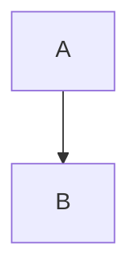

After years of running this blog on Jekyll, I finally made the switch to Hugo. Here's why I did it and how you can too.

<!--more-->

## Why I Made the Switch

Jekyll served me well for years, but a few pain points pushed me toward Hugo:

- **Build times**: As my site grew, Jekyll builds became noticeably slower
- **Ruby dependencies**: Managing Ruby versions and gems was sometimes frustrating
- **Theme flexibility**: I wanted more modern theme options with better dark mode support

Hugo promised faster builds, a single binary with no dependencies, and a vibrant theme ecosystem.

## Choosing a Theme

I settled on the [Blowfish](https://blowfish.page/) theme for several reasons:

- Clean, modern design
- Excellent dark mode support
- Built-in support for taxonomies (categories and tags)
- Active development and documentation
- Tailwind CSS for easy customization

## The Migration Process

### Step 1: Project Setup

First, I created a new Hugo site and added the Blowfish theme as a Git submodule:

```bash
hugo new site my-blog
cd my-blog
git init
git submodule add https://github.com/nunocoracao/blowfish.git themes/blowfish
```

### Step 2: Configuration

Hugo uses TOML, YAML, or JSON for configuration. I chose TOML and split my config across multiple files in `config/_default/`:

- `config.toml` - Base site configuration
- `params.toml` - Theme parameters
- `menus.toml` - Navigation menus
- `languages.toml` - Language settings

### Step 3: Content Migration

The biggest task was migrating my existing posts. Most Jekyll posts worked with minimal changes:

**Front matter differences:**

```yaml
# Jekyll
---
layout: post
title: "My Post"
date: 2024-01-15
categories: development
tags: [docker, containers]
---

# Hugo
---
title: "My Post"
date: 2024-01-15
categories:
  - Development
tags:
  - Docker
  - Containers
---
```

Key changes:

- Removed `layout: post` (Hugo infers this from content location)
- Converted tags and categories to arrays
- Standardized capitalization

### Step 4: Fixing Shortcodes

Jekyll uses Liquid templates while Hugo uses its own shortcode system. Some conversions I made:

**Images:**

```markdown
<!-- Jekyll -->


<!-- Hugo -->

```

**Mermaid diagrams:**

```markdown
<!-- Jekyll (with mermaid plugin) -->


<!-- Hugo (Blowfish shortcode) -->

graph TD
    A --> B

```

### Step 5: Static Assets

I moved my static files:

- Jekyll `assets/images/` → Hugo `static/images/`
- Jekyll `_data/` → Hugo `data/`

### Step 6: GitHub Actions

Updated my deployment workflow from Jekyll to Hugo:

```yaml
name: Deploy Hugo site to Pages

on:
  push:
    branches: ["main"]
  workflow_dispatch:

permissions:
  contents: read
  pages: write
  id-token: write

jobs:
  build:
    runs-on: ubuntu-latest
    steps:
      - uses: actions/checkout@v4
        with:
          submodules: recursive
          fetch-depth: 0

      - name: Setup Hugo
        uses: peaceiris/actions-hugo@v3
        with:
          hugo-version: 'latest'
          extended: true

      - name: Build
        run: hugo --minify

      - name: Upload artifact
        uses: actions/upload-pages-artifact@v3
        with:
          path: ./public

  deploy:
    needs: build
    runs-on: ubuntu-latest
    environment:
      name: github-pages
      url: ${{ steps.deployment.outputs.page_url }}
    steps:
      - name: Deploy to GitHub Pages
        id: deployment
        uses: actions/deploy-pages@v4
```

## Challenges and Solutions

### Challenge 1: Taxonomy URLs

Jekyll and Hugo handle category/tag URLs differently. I added aliases in Hugo to preserve old URLs:

```yaml
# In a post's front matter
aliases:
  - /category/development/my-post/
```

### Challenge 2: Date Formatting

Hugo's date formatting uses Go's reference time. It took some getting used to:

```go
// Go reference time: Mon Jan 2 15:04:05 MST 2006
{{ .Date.Format "January 2, 2006" }}
```

### Challenge 3: Custom Layouts

Some Jekyll layouts needed to be recreated. Hugo's template lookup order is powerful but has a learning curve.

## Results

After the migration:

- **Build time**: Dropped from 30+ seconds to under 1 second
- **No dependencies**: Just the Hugo binary
- **Better DX**: Hot reload is nearly instant
- **Modern design**: Blowfish looks great on all devices

## Tips for Your Migration

1. **Start fresh**: Create a new Hugo site rather than converting in place
2. **Migrate incrementally**: Move posts in batches and test as you go
3. **Use Hugo's built-in server**: `hugo server -D` shows drafts and hot reloads
4. **Read the theme docs**: Blowfish has excellent documentation
5. **Test thoroughly**: Check all pages, especially taxonomy pages

## Conclusion

The migration took a weekend of focused work, but it was worth it. Hugo's speed and flexibility have made maintaining this blog much more enjoyable.

If you're considering the switch, I hope this guide helps. Feel free to reach out with questions!

## Resources

- [Hugo Documentation](https://gohugo.io/documentation/)
- [Blowfish Theme](https://blowfish.page/)
- [Jekyll to Hugo Migration Guide](https://gohugo.io/tools/migrations/#jekyll)
