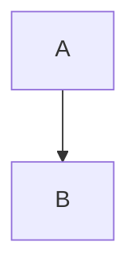

In Part 1, I covered why I switched from Jekyll to Hugo. Now let's dive into the actual content migration.

<!--more-->

## Front Matter Conversion

Most Jekyll posts work with minimal changes, but there are key differences:

```yaml
# Jekyll
---
layout: post
title: "My Post"
date: 2024-01-15
categories: development
tags: [docker, containers]
mermaid: true
---

# Hugo
---
title: "My Post"
date: 2024-01-15
categories:
  - Development
tags:
  - Docker
  - Containers
---
```

Key changes I made:

- **Removed `layout: post`** - Hugo infers layout from content location
- **Converted tags/categories to arrays** - YAML list format
- **Standardized capitalization** - Consistent taxonomy naming
- **Removed `mermaid: true`** - Blowfish auto-detects mermaid shortcodes

## Shortcode Conversions

Jekyll uses Liquid templates while Hugo has its own shortcode system.

### Images and Figures

```markdown
<!-- Jekyll -->


<!-- Hugo -->

```

### Mermaid Diagrams

This was a bigger change. Jekyll with the mermaid plugin uses fenced code blocks:

````markdown
<!-- Jekyll -->

````

Hugo with Blowfish requires the mermaid shortcode:

```markdown
<!-- Hugo -->

graph TD
    A --> B

```

I wrote a quick script to find and convert these across all posts.

### Code Blocks

Standard fenced code blocks work the same, but Hugo adds features:

```markdown
<!-- Hugo with line numbers -->

func main() {
    fmt.Println("Hello")
    fmt.Println("Highlighted!")
}

```

## Static Assets

Jekyll and Hugo organize assets differently:

| Jekyll | Hugo |
|--------|------|
| `assets/images/` | `static/images/` |
| `_data/` | `data/` |
| `_includes/` | `layouts/partials/` |

For images referenced in posts, I kept paths like `/images/photo.jpg` which maps to `static/images/photo.jpg`.

## Handling Excerpts

Jekyll uses `excerpt_separator` in config or `<!--more-->` in posts. Hugo works the same way with `<!--more-->`:

```markdown
---
title: "My Post"
---

This appears in the summary.

<!--more-->

This is the full content.
```

## Taxonomy Cleanup

I took the opportunity to consolidate tags:

- Merged similar tags (`vscode` → `VSCode`)
- Standardized capitalization
- Removed unused categories

## Bulk Migration Script

For 60+ posts, I used a simple PowerShell script:

```powershell
Get-ChildItem "content/posts/*.md" | ForEach-Object {
    $content = Get-Content $_.FullName -Raw
    
    # Remove layout: post
    $content = $content -replace "layout: post\r?\n", ""
    
    # Remove mermaid: true
    $content = $content -replace "mermaid: true\r?\n", ""
    
    Set-Content $_.FullName $content
}
```

## What's Next

In Part 3, I'll cover deployment with GitHub Actions and the challenges I encountered along the way.

## Resources

- [Hugo Content Organization](https://gohugo.io/content-management/organization/)
- [Hugo Shortcodes](https://gohugo.io/content-management/shortcodes/)
- [Blowfish Shortcodes](https://blowfish.page/docs/shortcodes/)
